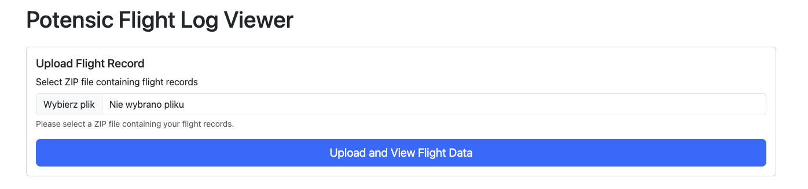
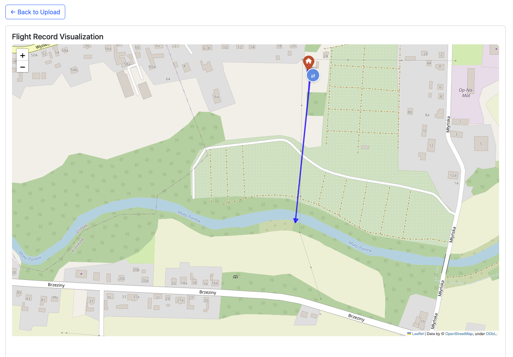

# Potensic Flight Log Viewer

A web application for visualizing and analyzing flight data from Potensic drones. This application allows users to upload their drone flight logs and view the flight path on an interactive map, complete with telemetry data.




## Features

- Upload and process Potensic drone flight logs (ZIP files)
- Interactive map visualization of flight paths

## Requirements

- Python 3.x
- Flask web framework
- Additional Python packages (specified in requirements.txt)

## Installation

### Local Development Setup

1. Clone the repository:
   ```bash
   git clone https://github.com/bgruszka/potensic-flight-log-viewer.git
   cd potensic-flight-log-viewer
   ```

2. Create and activate a virtual environment (optional but recommended):
   ```bash
   python -m venv venv
   source venv/bin/activate  # On Windows use: venv\Scripts\activate
   ```

3. Install dependencies:
   ```bash
   pip install -r requirements.txt
   ```

### Docker Setup

1. Build and run using Docker Compose:
   ```bash
   docker-compose up --build
   ```

## Usage

### Running the Application

#### Local Development

1. Start the Flask development server:
   ```bash
   python app.py
   ```
2. Open your web browser and navigate to: `http://localhost:5000`

#### Docker Deployment

1. After running `docker-compose up`, access the application at: `http://localhost:8085`

### Using the Application

1. Prepare your flight log:
   - Locate the ZIP file containing your Potensic drone flight data
   - The ZIP file should contain FC (Flight Controller) and FPV files

2. Upload and view flight data:
   - Click the "Select ZIP file" button on the homepage
   - Choose your flight log ZIP file
   - Click "Upload" to process the data
   - The application will display your flight path on an interactive map

3. Map features:
   - Blue line shows the flight path
   - Arrows indicate flight direction
   - Red home position marker shows the takeoff location
   - Green/Red markers show start and end points
   - Click markers for additional information

## Supported File Formats

- ZIP files containing:
  - FC (Flight Controller) files: `.fc` or `-FC.bin` extensions
  - FPV (First Person View) files: `-FPV.bin` extension

## Troubleshooting

- Ensure your ZIP file contains valid flight controller data
- Check that file names follow the expected format
- Verify that the flight log contains valid GPS coordinates
- For Docker deployment issues, ensure ports 8000 is not in use

## License

This project is open source and available under the MIT License.

## Acknowledgments

This project was inspired by and built upon the work from [potdroneflightparser](https://github.com/koen-aerts/potdroneflightparser), which provided valuable insights into parsing Potensic drone flight logs.

## Contributing

Contributions are welcome! Please feel free to submit a Pull Request.